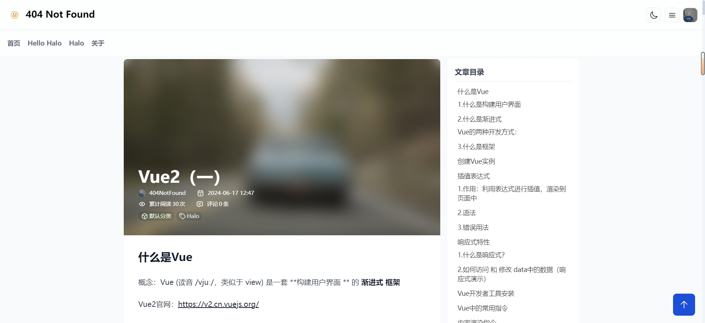

<br />
<div align="center">
  <a href="https://github.com/haoanlan/halo-theme-crux-4zero4">
    
  </a>

<h3 align="center">Crux</h3>
    
</div>

## 简介
本主题是[Snuffel233](https://github.com/Snuffel233)开发的[halo-theme-crux](https://github.com/Snuffel233/halo-theme-crux)，主题的风格我比较喜欢，所以本菜鸡进行简单的新版本适配和主观的ui改动。
## 🚨 注意事项
1. 由于我比较菜鸡，所以可能存在一些未知bug，请谅解。
2. 如遇到bug建议自行解决或者提pr，因为提给我我也不会修（太菜了）。
3. 不要期望更新，除非我实在受不了了bug了并且钻研出来了。
## 预览
https://crux.4zero4.cn/
<br/>
图片预览




## to do
- [ ]对我自己发现并且忍受不了的bug进行修改。
- [ ]页面跳转加入过渡动画。
- [x]优化随机封面图api机制
- [ ]社交账号值的介绍（原作者文档已失效）

## 主题目录结构

   ```
   .
   ├── templates
   │   ├── modules
   │   │   ├── components
   │   │   │   ├── archives-post-card.html
   │   │   │   ├── footer-basic.html
   │   │   │   ├── footer.html
   │   │   │   ├── health-check.html
   │   │   │   ├── hero.html
   │   │   │   ├── nav.html
   │   │   │   ├── post-card.html
   │   │   │   ├── social-card.html
   │   │   │   ├── social.html
   │   │   │   └── user-card.html
   │   │   ├── icon
   │   │   │   ├── github.html
   │   │   │   ├── links.html //remove soon
   │   │   │   └── qq.html
   │   │   └── layout.html
   │   ├── assets
   │   │   └── dist
   │   │       ├── main.iife.js
   │   │       └── style.css
   │   ├── archives.html
   │   ├── author.html
   │   ├── categories.html
   │   ├── category.html
   │   ├── index.html
   │   ├── links.html
   │   ├── moments.html
   │   ├── page.html
   │   ├── page_about_personal.html
   │   ├── page_github.html
   │   ├── photos.html
   │   ├── post.html
   │   ├── tag.html
   │   └── tags.html
   ├── annotation-setting.yaml
   ├── settings.yaml
   └── theme.yaml
   ```
